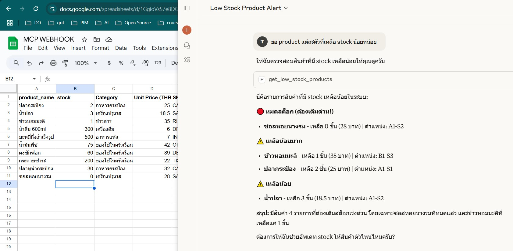

เริ่มต้น
activate venv ที่ลองก่อนรัน
```commandline
venv\Scripts\activate.bat
```

run main ตัวอย่างทำ api mcp บน root
```commandline
uv run main.py
```
#ใช้คู่กับ claude desktop ได้เลย

===

next in mcp_webhook folder: 

setup config.json ของ claude desktop ตาม example.json

ตัวอย่างใน folder mcp_webhook
following MCP_WEBHOOK.MD

คำสั่งใช้บ่อยบน windows เพื่อปิด claude processes
```power shell
Get-Process | Where-Object { $_.Path -like "*claude*" } | Stop-Process -Force
```


ภาพตัวอย่างการถามตอบจาก google sheet ผ่าน claude desktop
